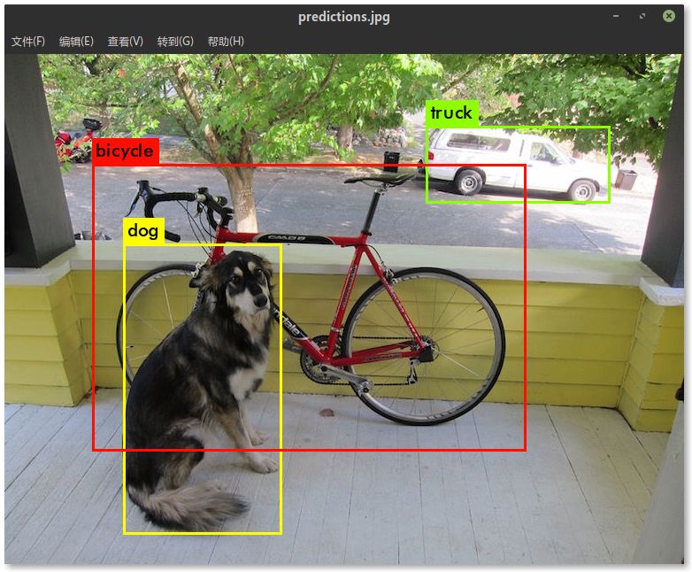

# Darknet
Darknet is an open source neural network framework written in C and CUDA. It is fast, easy to install, and supports CPU and GPU computation.

For more information see the [Darknet project website](http://pjreddie.com/darknet).

## 环境部署
#### 服务器环境信息

```
OS: Ubuntu 16.04
Kernel: x86_64 Linux 4.13.0-38-generic
CPU: Intel Xeon CPU E5-2620 v3 @ 3.2GHz
GPU: 双路 GeForce GTX 1080
RAM: 32 GB
CUDA: 8.0.61
cuDNN: 7.0.5
GCC: 4.9.4
Python: 3.5
```

 #### CUDA 及 cuDNN 环境配置

```
vi ~/.bashrc
```


追加以下内容:

```
export PATH=/usr/local/cuda-8.0/bin:$PATH
# 服务器环境 cuDNN 配置可能存在问题, 故自行配置如下路径
export LD_LIBRARY_PATH=/path/to/your/cudnn-lib-files:$LD_LIBRARY_PATH
# 例: export LD_LIBRARY_PATH=/server_space/zhaoym/cuda/tmp:$LD_LIBRARY_PATH
```

使配置生效:

```
source ~/.bashrc
```

#### 编译

克隆官方代码

```
git clone https://github.com/pjreddie/darknet
```

切换到 darknet 目录, 修改 Makefile

```
cd darknet
vi Makefile
```

> GPU=1  
> CUDNN=1  
> OPENCV=0 # 若需检测视频等, 则修改为 1, OpenCV 配置方法略
>
> . . . . . . .
>
> COMMON+= -DGPU -I/usr/local/cuda/include/ # 需根据服务器 CUDA 安装路径修改  
> CFLAGS+= -DGPU  
> LDFLAGS+= -L/usr/local/cuda/lib64 -lcuda -lcudart -lcublas -lcurand   # 需根据 cuDNN 路径修改
>
> 例:   
> COMMON+= -DGPU -I/usr/local/cuda-8.0/include/  
> LDFLAGS+= -L/server_space/zhaoym/cuda/tmp -lcuda -lcudart -lcublas -lcurand

```
make    # 编译
```

若编译失败需执行 make clean, 修改后重新 make 即可

#### 验证是否配置成功

下载官方预训练权重

```
wget https://pjreddie.com/media/files/yolov3.weights
```

修改配置文件

```
vi cfg/yolov3.cfg
```

进行如下修改后保存退出

```
[net]
# Testing
batch=1             # 取消注释
subdivisions=1      # 取消注释
# Training      
# batch=64          # 注释掉
# subdivisions=16   # 注释掉
```

检测测试

```
./darknet detect cfg/yolov3.cfg yolov3.weights data/dog.jpg
```

输出如下

```
layer     filters    size              input                output
    0 conv     32  3 x 3 / 1   416 x 416 x   3   ->   416 x 416 x  32  0.299 BFLOPs
    1 conv     64  3 x 3 / 2   416 x 416 x  32   ->   208 x 208 x  64  1.595 BFLOPs
    .......
  105 conv    255  1 x 1 / 1    52 x  52 x 256   ->    52 x  52 x 255  0.353 BFLOPs
  106 detection
truth_thresh: Using default '1.000000'
Loading weights from yolov3.weights...Done!
data/dog.jpg: Predicted in 0.029329 seconds.
dog: 99%
truck: 93%
bicycle: 99%
```

标注图片在项目根目录下, 名为 `predictions.png`



## 训练

下面以在[西工大遥感数据集](http://jiong.tea.ac.cn/people/JunweiHan/NWPUVHR10dataset.html)上训练模型为例演示如何训练自己的数据

该数据集也可从本项目目录中[直接下载](https://github.com/lqwrl542293/JL-Yang_CV/blob/master/ObjectDetection2018/dataset/NWPU%20VHR-10%20dataset.rar)

#### 数据集标注转换

下载数据集并放到 darknet 目录下, 解压并将文件夹中的空格替换

```
unrar x NWPU\ VHR-10\ dataset.rar
mv NWPU\ VHR-10\ dataset NWPU_VHR-10_dataset
cd NWPU_VHR-10_dataset
mv ground\ truth ground_truth
mv positive\ image\ set positive_image_set
```

转换标注, 代码见 [Github](https://github.com/zcybupt/zcybupt.github.io/blob/master/codes/nwpu_vhr_label.py)

```
pip install numpy opencv-python scikit-image pillow    # 安装所需 Python 库
mkdir labels
python nwpu_vhr_label.py
```

输出如下

```
492     # 训练集数量


158     # 测试集数量


650     # 图片总数
```

输出文件有 `tran.txt`, `val.txt` 以及 `labels` 文件夹下的 650 个转换后的标注

darknet 默认标注文件与图片在同一目录, 故需将 `labels`文件夹下的 txt 复制到 `positive_image_set` 中

```
cp labels/*.txt positive_image_set
```

#### 准备训练配置文件

```
cd ..
mkdir 0913_NWPU_v3
cd 0913_NWPU_v3
mkdir backup
cp ../cfg/yolov3-voc.cfg ./
cp ../NWPU_VHR-10_dataset/*.txt ./
```

创建 `NWPU.data` 文件并写入以下内容

```
classes= 10
train  = 0913_NWPU_v3/train.txt
valid  = 0913_NWPU_v3/val.txt
names  = 0913_NWPU_v3/NWPU.names
backup = 0913_NWPU_v3/backup/
```

> classes                类别数量  
> train                    训练集文件列表  
> valid                    验证集文件列表  
> names                类别名称文件  
> backup               权重存放目录

创建 `NWPU.names` 文件并写入以下内容

```
aeroplane
ship
storage_tank
baseball_diamond
tennis_court
basketball_court
ground_track_field
harbor
bridge
vehicle
```

修改 `yolov3-voc.cfg`

```
[net]
# Testing
# batch=1           # 注释掉
# subdivisions=1    # 注释掉
#Training
batch=64            # 取消注释
subdivisions=16     # 取消注释
......
# 605, 689, 773 行的 filters
filters=45          # (4个位置 + 1个objectness + C个类别) * 3, 只改 [yolo] 层上一层中的filters
# 611, 695, 779 行的 classes
classes=10          # 类别数
```

#### 训练

下载预训练文件

```
cd ..
wget https://pjreddie.com/media/files/darknet53.conv.74
```

开始训练

```
./darknet detector train 0913_NWPU_v3/voc.data 0913_NWPU_v3/yolov3-voc.cfg darknet53.conv.74 -gpus 0,1
```

> -gpus 指定训练使用的 GPU, 这里使用了第 0 块和第 1 块显卡

输出

```
layer     filters    size              input                output
    0 conv     32  3 x 3 / 1   416 x 416 x   3   ->   416 x 416 x  32  0.299 BFLOPs
    1 conv     64  3 x 3 / 2   416 x 416 x  32   ->   208 x 208 x  64  1.595 BFLOPs
    2 conv     32  1 x 1 / 1   208 x 208 x  64   ->   208 x 208 x  32  0.177 BFLOPs
    ......
  105 conv     45  1 x 1 / 1    52 x  52 x 256   ->    52 x  52 x  45  0.062 BFLOPs
  106 yolo
Loading weights from darknet53.conv.74...Done!
Learning Rate: 0.001, Momentum: 0.9, Decay: 0.0005
Resizing
320
Loaded: 0.000029 seconds
Region 82 Avg IOU: -nan, Class: -nan, Obj: -nan, No Obj: 0.539972, .5R: -nan, .75R: -nan,  count: 0
Region 94 Avg IOU: 0.527418, Class: 0.748367, Obj: 0.665674, No Obj: 0.590720, .5R: 1.000000, .75R: 0.000000,  count: 1
Region 106 Avg IOU: 0.204739, Class: 0.530762, Obj: 0.475587, No Obj: 0.427459, .5R: 0.142857, .75R: 0.000000,  count: 42
Region 82 Avg IOU: 0.334140, Class: 0.682158, Obj: 0.326366, No Obj: 0.540248, .5R: 0.000000, .75R: 0.000000,  count: 1
Region 94 Avg IOU: 0.279358, Class: 0.548496, Obj: 0.595618, No Obj: 0.589648, .5R: 0.333333, .75R: 0.166667,  count: 6
Region 106 Avg IOU: 0.175368, Class: 0.478585, Obj: 0.391913, No Obj: 0.430448, .5R: 0.000000, .75R: 0.000000,  count: 9
......
```

**注:**

1. `yolov3-voc.cfg` 配置文件中的 `batch` 和 `subdivisions` 需根据 GPU 显存大小修改, 若显存较小, 应相应地减小 `batch` 增大 `subdivisions`

2. 查看显存占用可用 `nvidia-smi`, 输出如下

   ```
   Wed Mar 13 15:36:29 2019       
   +-----------------------------------------------------------------------------+
   | NVIDIA-SMI 384.111                Driver Version: 384.111                   |
   |-------------------------------+----------------------+----------------------+
   | GPU  Name        Persistence-M| Bus-Id        Disp.A | Volatile Uncorr. ECC |
   | Fan  Temp  Perf  Pwr:Usage/Cap|         Memory-Usage | GPU-Util  Compute M. |
   |===============================+======================+======================|
   |   0  GeForce GTX 1080    Off  | 00000000:02:00.0 Off |                  N/A |
   | 59%   83C    P2   104W / 180W |   2729MiB /  8112MiB |     93%      Default |
   +-------------------------------+----------------------+----------------------+
   |   1  GeForce GTX 1080    Off  | 00000000:03:00.0 Off |                  N/A |
   | 54%   81C    P2   133W / 180W |   6861MiB /  8114MiB |     18%      Default |
   +-------------------------------+----------------------+----------------------+                                                                            
   +-----------------------------------------------------------------------------+
   | Processes:                                                       GPU Memory |
   |  GPU       PID   Type   Process name                             Usage      |
   |=============================================================================|
   |    0     28529      C   python                                      2719MiB |
   |    1      2040      C   python3                                     6851MiB |
   +-----------------------------------------------------------------------------+
   ```

3. 如果输出中全都是 `-nan`, `count` 全为 `0` 问题很有可能在数据集上

4. 官方代码默认前 `1000`次, 每 `100` 次保存一次权重；`1000` 次之后每 `10000` 次保存一次权重, 可在 `examples/detector.c` 的 `130` 及 `138` 行自行修改, 重新编译即可生效

5. 若训练中途停止, 将训练命令中的 `darknet53.conv.74` 改为已得到的最新的权重的路径即可继续训练

6. 训练输出日志含义见[此文](https://blog.csdn.net/gzj2013/article/details/82285511)

7. 保存训练日志到文件追加 `tee` 命令, 例如

   ```
   ./darknet detector train 0913_NWPU_v3/voc.data 0913_NWPU_v3/yolov3-voc.cfg darknet53.conv.74 -gpus 0,1 | tee -a 0913_train.log
   ```

## 评估

#### 生成检测结果

修改 `yolov3-voc.cfg`

```
[net]
# Testing
batch=1             # 取消注释
subdivisions=1      # 取消注释
# Training      
# batch=64          # 注释掉
# subdivisions=16   # 注释掉
```

使用 valid 命令，将验证集结果批量生成

```
./darknet detector valid 0913_NWPU_v3/NWPU.data 0913_NWPU_v3/yolov3-voc.cfg 0913_NWPU_v3/backup/yolov3-voc_10500.weights
```

输出如下

```
results: Using default 'results'
layer     filters    size              input                output
    0 conv     32  3 x 3 / 1   416 x 416 x   3   ->   416 x 416 x  32  0.299 BFLOPs
    1 conv     64  3 x 3 / 2   416 x 416 x  32   ->   208 x 208 x  64  1.595 BFLOPs
    2 conv     32  1 x 1 / 1   208 x 208 x  64   ->   208 x 208 x  32  0.177 BFLOPs
    ......
  105 conv     45  1 x 1 / 1    52 x  52 x 256   ->    52 x  52 x  45  0.062 BFLOPs
  106 yolo
Loading weights from 0913_NWPU_v3/backup/yolov3-voc_10500.weights...Done!
Learning Rate: 0.001, Momentum: 0.9, Decay: 0.0005
eval: Using default 'voc'
4
8
12
......
160
Total Detection Time: 14.854030 Seconds
```

输出文件均保存在 `results` 目录下

#### 计算 mAP

将西工大数据集转换为 VOC 格式, 代码: [nwpu2voc.py](https://github.com/zcybupt/zcybupt.github.io/blob/master/codes/nwpu2voc/nwpu2voc.py)

```
cd NWPU_VHR-10_dataset
python nwpu2voc.py  # 将 nwpu2voc.py 放到 NWPU_VHR-10_dataset 目录下
```

下载 [reval_voc.py](https://github.com/zcybupt/zcybupt.github.io/blob/master/codes/voc%E8%AF%84%E4%BC%B0/reval_voc.py) 和 [voc_eval.py](https://github.com/zcybupt/zcybupt.github.io/blob/master/codes/voc%E8%AF%84%E4%BC%B0/voc_eval.py), 以下代码需在 `Python2` 环境下运行并预先装好 `numpy`, 推荐用 `Miniconda` 管理 Python 环境

```
cd ..
python reval_voc.py --voc_dir NWPU_VHR-10_dataset/VOCdevkit --year 2007 --image_set test --class ./0913_NWPU_v3/NWPU.names ./valid_results
```

输出如下

```
Evaluating detections
VOC07 metric? Yes
AP for aeroplane = 0.9949
AP for ship = 0.8182
AP for storage_tank = 0.8013
AP for baseball_diamond = 0.9827
AP for tennis_court = 0.8040
AP for basketball_court = 0.8182
AP for ground_track_field = 0.9947
AP for harbor = 0.7442
AP for bridge = 0.8961
AP for vehicle = 0.8689
Mean AP = 0.8723

--------------------------------------------------------------
Results computed with the **unofficial** Python eval code.
Results should be very close to the official MATLAB eval code.
-- Thanks, The Management
--------------------------------------------------------------
```

更多信息参见 [Darknet 评估训练好的网络的性能](https://www.jianshu.com/p/7ae10c8f7d77)

## 其它参考资料

[DarkNet-YOLOv3 训练自己的数据集 Ubuntu16.04+cuda8.0](https://zhuanlan.zhihu.com/p/35490655)

[YOLOv3批量测试图片并保存在自定义文件夹下](https://blog.csdn.net/mieleizhi0522/article/details/79989754)

[YOLO(v1)用自己的数据集训练模型](https://blog.csdn.net/sinat_30071459/article/details/53100791)

## 后记

个人水平有限, 文章难免出现错误, 欢迎指出
